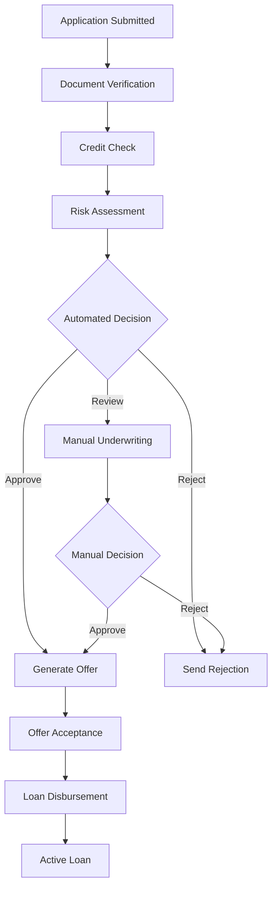

# Microcredit Service Documentation

## Overview

The Microcredit Service provides comprehensive financial services and credit management capabilities for the Quenty platform. It enables customers to access credit facilities, manage loan applications, track repayments, and build credit history within the logistics ecosystem.

## Service Details

- **Port**: 8005
- **Database**: PostgreSQL (microcredit_db)
- **Base URL**: `http://localhost:8005`
- **Health Check**: `GET /health`

## Core Features

### 1. Credit Application Management
- Credit application processing and approval
- Risk assessment and credit scoring
- Document verification and KYC compliance
- Automated and manual underwriting processes

### 2. Loan Management
- Loan disbursement and tracking
- Flexible repayment schedules
- Interest calculation and fee management
- Early payment and partial payment handling

### 3. Credit Scoring and Assessment
- Dynamic credit scoring algorithms
- Payment history analysis
- Transaction pattern evaluation
- Risk categorization and limit setting

### 4. Payment Processing
- Automated payment collection
- Multiple payment method support
- Payment schedule management
- Late payment handling and penalties

### 5. Credit History and Reporting
- Comprehensive credit history tracking
- Credit bureau reporting integration
- Customer credit reports
- Performance analytics and insights

## Data Models

### Credit Application Model
```python
class CreditApplication(Base):
    __tablename__ = "credit_applications"
    
    id = Column(Integer, primary_key=True, index=True)
    application_id = Column(String(255), unique=True, index=True)
    
    # Customer Information
    customer_id = Column(String(255), nullable=False, index=True)
    customer_type = Column(String(50), default="individual")
    
    # Application Details
    requested_amount = Column(Numeric(12, 2), nullable=False)
    requested_term_months = Column(Integer, nullable=False)
    purpose = Column(String(100), nullable=False)
    application_type = Column(String(50), default="new")
    
    # Financial Information
    monthly_income = Column(Numeric(12, 2))
    employment_status = Column(String(50))
    employment_duration = Column(Integer)  # months
    existing_debts = Column(Numeric(12, 2), default=0)
    
    # Credit Assessment
    credit_score = Column(Integer)
    risk_category = Column(String(20))  # low, medium, high
    approved_amount = Column(Numeric(12, 2))
    approved_term_months = Column(Integer)
    interest_rate = Column(Numeric(5, 4))  # Annual percentage rate
    
    # Status and Processing
    status = Column(String(50), default="pending")
    decision_reason = Column(Text)
    processed_by = Column(String(255))
    decision_date = Column(DateTime)
    
    # Documentation
    documents_submitted = Column(JSON, default=list)
    verification_status = Column(String(50), default="pending")
    
    # System Fields
    created_at = Column(DateTime, default=func.now())
    updated_at = Column(DateTime, default=func.now(), onupdate=func.now())
    expires_at = Column(DateTime)
    
    # Relationships
    loans = relationship("Loan", back_populates="application")
    credit_checks = relationship("CreditCheck", back_populates="application")
```

### Loan Model
```python
class Loan(Base):
    __tablename__ = "loans"
    
    id = Column(Integer, primary_key=True, index=True)
    loan_id = Column(String(255), unique=True, index=True)
    
    # Relationships
    application_id = Column(Integer, ForeignKey("credit_applications.id"))
    customer_id = Column(String(255), nullable=False, index=True)
    
    # Loan Terms
    principal_amount = Column(Numeric(12, 2), nullable=False)
    interest_rate = Column(Numeric(5, 4), nullable=False)  # Annual percentage rate
    term_months = Column(Integer, nullable=False)
    monthly_payment = Column(Numeric(10, 2), nullable=False)
    
    # Status and Dates
    status = Column(String(50), default="active")
    disbursement_date = Column(Date, nullable=False)
    first_payment_date = Column(Date, nullable=False)
    maturity_date = Column(Date, nullable=False)
    
    # Financial Tracking
    total_amount_due = Column(Numeric(12, 2))
    amount_paid = Column(Numeric(12, 2), default=0)
    outstanding_balance = Column(Numeric(12, 2))
    accrued_interest = Column(Numeric(12, 2), default=0)
    late_fees = Column(Numeric(10, 2), default=0)
    
    # Payment Information
    next_payment_date = Column(Date)
    next_payment_amount = Column(Numeric(10, 2))
    payments_made = Column(Integer, default=0)
    payments_remaining = Column(Integer)
    days_past_due = Column(Integer, default=0)
    
    # Risk Management
    risk_category = Column(String(20))
    collection_status = Column(String(50))
    restructured = Column(Boolean, default=False)
    
    # System Fields
    created_at = Column(DateTime, default=func.now())
    updated_at = Column(DateTime, default=func.now(), onupdate=func.now())
    closed_at = Column(DateTime)
    
    # Relationships
    application = relationship("CreditApplication", back_populates="loans")
    payments = relationship("LoanPayment", back_populates="loan")
    payment_schedule = relationship("PaymentSchedule", back_populates="loan")
```

### Credit Score Model
```python
class CreditScore(Base):
    __tablename__ = "credit_scores"
    
    id = Column(Integer, primary_key=True, index=True)
    score_id = Column(String(255), unique=True, index=True)
    
    # Customer Reference
    customer_id = Column(String(255), nullable=False, index=True)
    
    # Score Information
    score = Column(Integer, nullable=False)  # 300-850 range
    score_date = Column(DateTime, nullable=False, default=func.now())
    score_version = Column(String(10), default="v2.0")
    
    # Score Components
    payment_history_score = Column(Integer)  # 35% weight
    credit_utilization_score = Column(Integer)  # 30% weight
    length_of_history_score = Column(Integer)  # 15% weight
    credit_mix_score = Column(Integer)  # 10% weight
    new_credit_score = Column(Integer)  # 10% weight
    
    # Risk Assessment
    risk_category = Column(String(20))  # excellent, good, fair, poor
    default_probability = Column(Numeric(5, 4))
    recommended_limit = Column(Numeric(12, 2))
    
    # Factors
    positive_factors = Column(JSON, default=list)
    negative_factors = Column(JSON, default=list)
    improvement_suggestions = Column(JSON, default=list)
    
    # Comparison
    previous_score = Column(Integer)
    score_change = Column(Integer)
    
    # System Fields
    calculated_by = Column(String(100), default="system")
    created_at = Column(DateTime, default=func.now())
```

## API Endpoints

### Credit Application Management

#### Submit Credit Application
```http
POST /api/v1/credit/applications
Authorization: Bearer <access_token>
Content-Type: application/json

{
    "customer_id": "CUST-789012345",
    "requested_amount": 50000.00,
    "requested_term_months": 24,
    "purpose": "business_expansion",
    "monthly_income": 15000.00,
    "employment_status": "employed",
    "employment_duration": 36,
    "existing_debts": 5000.00,
    "documents": [
        {
            "type": "income_proof",
            "url": "https://cdn.quenty.com/docs/income_proof_123.pdf"
        },
        {
            "type": "identity_document",
            "url": "https://cdn.quenty.com/docs/id_document_123.pdf"
        }
    ]
}
```

**Response:**
```json
{
    "application_id": "CA-2025072201",
    "customer_id": "CUST-789012345",
    "requested_amount": 50000.00,
    "requested_term_months": 24,
    "purpose": "business_expansion",
    "status": "pending",
    "reference_number": "QTY-CA-2025072201",
    "estimated_processing_time": "3-5 business days",
    "required_documents": [
        "income_proof",
        "identity_document",
        "address_proof"
    ],
    "expires_at": "2025-08-21T23:59:59.000Z",
    "created_at": "2025-07-22T10:30:00.000Z"
}
```

#### Get Application Status
```http
GET /api/v1/credit/applications/CA-2025072201
Authorization: Bearer <access_token>
```

**Response:**
```json
{
    "application_id": "CA-2025072201",
    "customer_id": "CUST-789012345",
    "status": "approved",
    "requested_amount": 50000.00,
    "approved_amount": 45000.00,
    "requested_term_months": 24,
    "approved_term_months": 24,
    "interest_rate": 0.1850,
    "monthly_payment": 2187.50,
    "credit_score": 725,
    "risk_category": "medium",
    "decision_reason": "Application approved with reduced amount due to debt-to-income ratio",
    "decision_date": "2025-07-24T14:30:00.000Z",
    "verification_status": "completed",
    "offer_expires_at": "2025-08-07T23:59:59.000Z"
}
```

#### List Applications
```http
GET /api/v1/credit/applications?status=approved&limit=20&offset=0
Authorization: Bearer <access_token>
```

### Loan Management

#### Accept Loan Offer
```http
POST /api/v1/credit/applications/CA-2025072201/accept
Authorization: Bearer <access_token>
Content-Type: application/json

{
    "acceptance_terms": "I accept the loan terms and conditions",
    "electronic_signature": "customer_signature_hash",
    "disbursement_method": "bank_transfer",
    "bank_account": {
        "account_number": "1234567890",
        "bank_name": "Banco Nacional",
        "account_holder": "Customer Name"
    }
}
```

**Response:**
```json
{
    "loan_id": "LOAN-2025072401",
    "application_id": "CA-2025072201",
    "status": "active",
    "principal_amount": 45000.00,
    "interest_rate": 0.1850,
    "term_months": 24,
    "monthly_payment": 2187.50,
    "disbursement_date": "2025-07-25",
    "first_payment_date": "2025-08-25",
    "maturity_date": "2025-07-25",
    "total_amount_due": 52500.00,
    "loan_agreement_url": "https://cdn.quenty.com/agreements/loan_LOAN-2025072401.pdf"
}
```

#### Get Loan Details
```http
GET /api/v1/credit/loans/LOAN-2025072401
Authorization: Bearer <access_token>
```

**Response:**
```json
{
    "loan_id": "LOAN-2025072401",
    "customer_id": "CUST-789012345",
    "status": "active",
    "principal_amount": 45000.00,
    "interest_rate": 0.1850,
    "term_months": 24,
    "monthly_payment": 2187.50,
    "disbursement_date": "2025-07-25",
    "outstanding_balance": 42000.00,
    "amount_paid": 10500.00,
    "next_payment_date": "2025-12-25",
    "next_payment_amount": 2187.50,
    "payments_made": 5,
    "payments_remaining": 19,
    "days_past_due": 0,
    "payment_history": [
        {
            "payment_date": "2025-08-25",
            "amount_paid": 2187.50,
            "principal_paid": 1500.00,
            "interest_paid": 687.50,
            "balance_after": 43500.00
        }
    ]
}
```

### Payment Processing

#### Make Loan Payment
```http
POST /api/v1/credit/loans/LOAN-2025072401/payments
Authorization: Bearer <access_token>
Content-Type: application/json

{
    "amount": 2187.50,
    "payment_method": "bank_transfer",
    "payment_date": "2025-12-25",
    "reference": "BANK_REF_123456789"
}
```

**Response:**
```json
{
    "payment_id": "PAY-20251225001",
    "loan_id": "LOAN-2025072401",
    "amount": 2187.50,
    "principal_amount": 1600.00,
    "interest_amount": 587.50,
    "payment_date": "2025-12-25",
    "payment_method": "bank_transfer",
    "status": "completed",
    "remaining_balance": 40400.00,
    "next_payment_date": "2026-01-25",
    "payments_remaining": 18,
    "receipt_url": "https://cdn.quenty.com/receipts/PAY-20251225001.pdf"
}
```

#### Get Payment Schedule
```http
GET /api/v1/credit/loans/LOAN-2025072401/schedule
Authorization: Bearer <access_token>
```

**Response:**
```json
{
    "loan_id": "LOAN-2025072401",
    "payment_schedule": [
        {
            "payment_number": 1,
            "due_date": "2025-08-25",
            "payment_amount": 2187.50,
            "principal": 1500.00,
            "interest": 687.50,
            "remaining_balance": 43500.00,
            "status": "paid"
        },
        {
            "payment_number": 2,
            "due_date": "2025-09-25",
            "payment_amount": 2187.50,
            "principal": 1523.13,
            "interest": 664.37,
            "remaining_balance": 41976.87,
            "status": "paid"
        },
        {
            "payment_number": 6,
            "due_date": "2025-12-25",
            "payment_amount": 2187.50,
            "principal": 1600.00,
            "interest": 587.50,
            "remaining_balance": 40400.00,
            "status": "due"
        }
    ],
    "total_payments": 24,
    "total_interest": 7500.00,
    "total_amount": 52500.00
}
```

### Credit Scoring and Assessment

#### Get Credit Score
```http
GET /api/v1/credit/customers/CUST-789012345/credit-score
Authorization: Bearer <access_token>
```

**Response:**
```json
{
    "customer_id": "CUST-789012345",
    "credit_score": 725,
    "score_date": "2025-07-22T10:00:00.000Z",
    "risk_category": "good",
    "score_range": {
        "min": 300,
        "max": 850
    },
    "score_components": {
        "payment_history": {
            "score": 85,
            "weight": 35,
            "description": "Good payment history with occasional late payments"
        },
        "credit_utilization": {
            "score": 78,
            "weight": 30,
            "description": "Credit utilization at 35% of available credit"
        },
        "length_of_history": {
            "score": 72,
            "weight": 15,
            "description": "Credit history of 3 years"
        },
        "credit_mix": {
            "score": 68,
            "weight": 10,
            "description": "Limited variety of credit types"
        },
        "new_credit": {
            "score": 75,
            "weight": 10,
            "description": "Recent credit inquiries within normal range"
        }
    },
    "previous_score": 710,
    "score_change": 15,
    "positive_factors": [
        "Consistent payment history over the last 12 months",
        "No defaults or charge-offs",
        "Improving credit utilization ratio"
    ],
    "negative_factors": [
        "High credit utilization ratio (35%)",
        "Limited credit history length",
        "Recent credit inquiries"
    ],
    "improvement_suggestions": [
        "Reduce credit utilization below 30%",
        "Continue making on-time payments",
        "Consider diversifying credit types"
    ],
    "recommended_credit_limit": 75000.00,
    "default_probability": 0.0850
}
```

## Credit Scoring Algorithm

### Score Calculation Components

#### 1. Payment History (35% weight)
- On-time payment percentage
- Late payment frequency and severity
- Defaults and charge-offs
- Recent payment behavior trends

```python
def calculate_payment_history_score(payment_data):
    on_time_payments = payment_data['on_time_count']
    total_payments = payment_data['total_count']
    late_payments = payment_data['late_count']
    defaults = payment_data['default_count']
    
    on_time_ratio = on_time_payments / max(total_payments, 1)
    
    base_score = on_time_ratio * 100
    
    # Penalties
    base_score -= late_payments * 5  # 5 points per late payment
    base_score -= defaults * 50      # 50 points per default
    
    return max(0, min(100, base_score))
```

#### 2. Credit Utilization (30% weight)
- Current balance to credit limit ratio
- Utilization trend over time
- Number of accounts with high utilization

#### 3. Length of Credit History (15% weight)
- Age of oldest account
- Average age of all accounts
- Time since most recent account opening

#### 4. Credit Mix (10% weight)
- Variety of credit types (installment, revolving)
- Management of different credit types
- Total number of credit accounts

#### 5. New Credit (10% weight)
- Number of recent credit inquiries
- Number of recently opened accounts
- Time since last account opening

### Risk Categorization

| Score Range | Risk Category | Description | Default Rate |
|-------------|---------------|-------------|--------------|
| 750-850 | Excellent | Exceptional credit | <2% |
| 700-749 | Good | Good credit | 2-5% |
| 650-699 | Fair | Fair credit | 5-10% |
| 600-649 | Poor | Poor credit | 10-20% |
| 300-599 | Very Poor | Very poor credit | >20% |

## Loan Processing Workflow

### Application Processing


### Automated Decision Rules

#### Auto-Approval Criteria
- Credit score ≥ 700
- Debt-to-income ratio ≤ 40%
- Stable employment history (≥12 months)
- No recent defaults or bankruptcies
- Loan amount ≤ 10x monthly income

#### Auto-Rejection Criteria
- Credit score < 550
- Debt-to-income ratio > 60%
- Recent bankruptcy (< 2 years)
- Current delinquencies
- Insufficient income verification

## Interest Rate Pricing

### Risk-Based Pricing Model
```python
def calculate_interest_rate(credit_score, loan_amount, term_months, risk_factors):
    base_rate = 0.12  # 12% base rate
    
    # Credit score adjustment
    if credit_score >= 750:
        score_adjustment = -0.03  # 3% discount
    elif credit_score >= 700:
        score_adjustment = -0.01  # 1% discount
    elif credit_score >= 650:
        score_adjustment = 0.0    # No adjustment
    elif credit_score >= 600:
        score_adjustment = 0.02   # 2% premium
    else:
        score_adjustment = 0.05   # 5% premium
    
    # Loan amount adjustment
    if loan_amount > 100000:
        amount_adjustment = -0.005  # 0.5% discount for large loans
    else:
        amount_adjustment = 0.0
    
    # Term adjustment
    if term_months > 36:
        term_adjustment = 0.01  # 1% premium for long terms
    else:
        term_adjustment = 0.0
    
    final_rate = base_rate + score_adjustment + amount_adjustment + term_adjustment
    
    return max(0.08, min(0.30, final_rate))  # Rate between 8% and 30%
```

## Collections and Recovery

### Collection Workflow
1. **Early Stage (1-30 days past due)**
   - Automated reminder notifications
   - SMS and email payment reminders
   - Grace period consideration

2. **Mid Stage (31-60 days past due)**
   - Phone call attempts
   - Payment plan negotiations
   - Account restrictions

3. **Late Stage (61-90 days past due)**
   - Formal collection notices
   - Escalation to collection agency
   - Legal action consideration

4. **Charge-off (90+ days past due)**
   - Account write-off
   - External collection agency
   - Credit bureau reporting

### Payment Recovery Strategies
- **Payment Plans**: Restructured payment schedules
- **Settlement Offers**: Reduced payment amounts
- **Hardship Programs**: Temporary payment deferrals
- **Refinancing Options**: Loan modification with new terms

## Regulatory Compliance

### Know Your Customer (KYC)
- Identity verification requirements
- Address verification
- Income verification
- Source of funds documentation

### Anti-Money Laundering (AML)
- Transaction monitoring
- Suspicious activity reporting
- Customer due diligence
- Enhanced due diligence for high-risk customers

### Consumer Protection
- Truth in Lending Act compliance
- Fair Credit Reporting Act compliance
- Equal Credit Opportunity Act compliance
- State-specific lending regulations

### Data Privacy
- GDPR compliance for EU customers
- Data encryption and security
- Customer consent management
- Right to deletion and data portability

## Integration Examples

### Customer Service Integration
```python
# Get customer credit information
async def get_customer_credit_summary(customer_id):
    applications = await get_customer_applications(customer_id)
    active_loans = await get_active_loans(customer_id)
    credit_score = await get_latest_credit_score(customer_id)
    
    return {
        'applications_count': len(applications),
        'active_loans_count': len(active_loans),
        'total_outstanding': sum(loan.outstanding_balance for loan in active_loans),
        'credit_score': credit_score.score if credit_score else None,
        'next_payment_due': min(loan.next_payment_date for loan in active_loans) if active_loans else None
    }
```

### Analytics Integration
```python
# Send loan performance metrics
await send_analytics_metric({
    "metric_type": "financial",
    "name": "loan_disbursed",
    "value": loan.principal_amount,
    "tags": {
        "customer_id": loan.customer_id,
        "risk_category": loan.risk_category,
        "term_months": str(loan.term_months)
    }
})
```

## Performance Metrics

### Portfolio Metrics
- **Total Loans Outstanding**: $45.2M
- **Default Rate**: 3.2%
- **Average Interest Rate**: 16.8%
- **Portfolio Yield**: 14.5%

### Operational Metrics
- **Application Approval Rate**: 68%
- **Average Processing Time**: 2.5 days
- **Customer Satisfaction**: 4.2/5.0
- **Collection Efficiency**: 85%

### Risk Metrics
- **30+ Days Past Due**: 5.8%
- **90+ Days Past Due**: 1.2%
- **Charge-off Rate**: 2.1%
- **Recovery Rate**: 42%

## Troubleshooting

### Common Issues

#### 1. Credit Score Calculation Errors
**Problem**: Incorrect credit scores being calculated
**Solution**:
- Verify data source accuracy
- Check calculation algorithm parameters
- Recalculate from raw data

#### 2. Payment Processing Failures
**Problem**: Loan payments not being processed
**Solution**:
- Check payment gateway connectivity
- Verify account and routing information
- Process manual payment if needed

#### 3. Application Processing Delays
**Problem**: Applications stuck in processing
**Solution**:
- Check document verification status
- Review automated decision rules
- Escalate to manual underwriting

### Debug Commands
```bash
# Check service health
curl http://localhost:8005/health

# Get customer credit score
curl -H "Authorization: Bearer <token>" \
  "http://localhost:8005/api/v1/credit/customers/CUST-123/credit-score"

# Check loan payment schedule
curl -H "Authorization: Bearer <token>" \
  "http://localhost:8005/api/v1/credit/loans/LOAN-123/schedule"
```