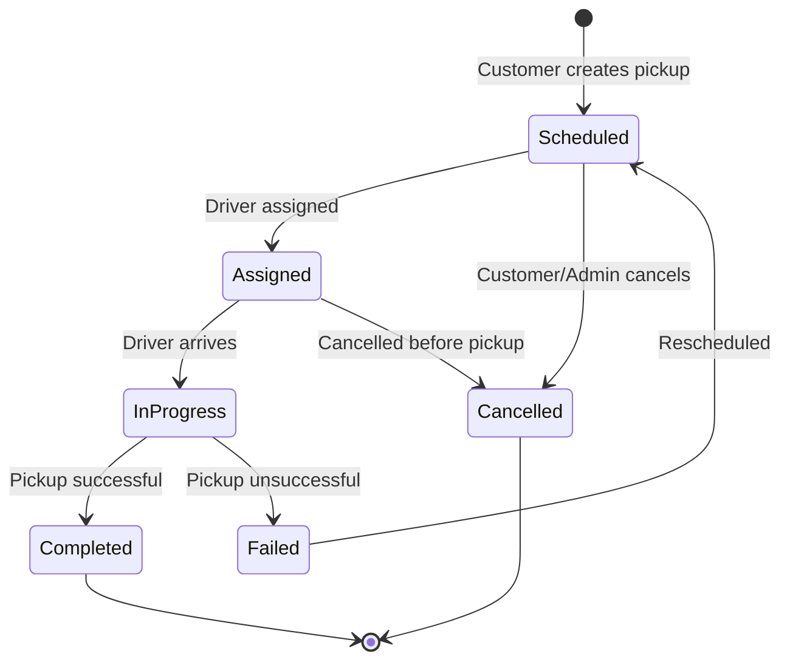

# Pickup Service Documentation

## Overview

The Pickup Service manages package pickup scheduling, route optimization, and driver coordination for the Quenty platform. It provides comprehensive pickup management capabilities including customer pickup requests, driver assignments, route optimization, and real-time tracking.

## Service Details

- **Port**: 8005
- **Database**: PostgreSQL (pickup_db)
- **Base URL**: `http://localhost:8005`
- **Health Check**: `GET /health`

## Core Features

### 1. Pickup Scheduling
- On-demand and scheduled pickup requests
- Flexible time window management
- Multi-package pickup support
- Capacity management by zone and time slot

### 2. Route Optimization
- Driver route creation and management
- Pickup assignment to routes
- Distance and duration optimization
- Real-time route tracking

### 3. Driver Management
- Driver assignment and coordination
- Vehicle type and capacity matching
- Performance tracking and metrics
- Work schedule management

### 4. Service Area Management
- Pickup zone configuration
- Service availability by postal code
- Dynamic pricing and fee structure
- Time slot availability management

### 5. Pickup Lifecycle Management
- Complete status tracking from request to completion
- Pickup attempt management and rescheduling
- Photo documentation and signature capture
- Package tracking number generation

## Data Models

### Pickup Model
```python
class Pickup(Base):
    __tablename__ = "pickups"
    
    id = Column(Integer, primary_key=True, index=True)
    pickup_id = Column(String(255), unique=True, index=True, nullable=False)
    customer_id = Column(String(255), nullable=False, index=True)
    
    # Pickup Details
    pickup_type = Column(String(50), nullable=False)  # on_demand, scheduled, recurring, express
    status = Column(String(50), default="scheduled", nullable=False)
    pickup_date = Column(Date, nullable=False)
    time_window_start = Column(Time, nullable=False)
    time_window_end = Column(Time, nullable=False)
    
    # Location Information
    pickup_address = Column(Text, nullable=False)
    pickup_latitude = Column(Float)
    pickup_longitude = Column(Float)
    postal_code = Column(String(20))
    city = Column(String(100))
    state = Column(String(100))
    country = Column(String(10), default="MX")
    
    # Contact Information
    contact_name = Column(String(255), nullable=False)
    contact_phone = Column(String(50), nullable=False)
    contact_email = Column(String(255))
    
    # Package Information
    package_count = Column(Integer, nullable=False)
    estimated_weight_kg = Column(Float, nullable=False)
    actual_weight_kg = Column(Float)
    estimated_volume_m3 = Column(Float)
    actual_volume_m3 = Column(Float)
    
    # Special Requirements
    requires_packaging = Column(Boolean, default=False)
    fragile_items = Column(Boolean, default=False)
    special_instructions = Column(Text)
    
    # Assignment Information
    assigned_driver_id = Column(String(255))
    assigned_vehicle_type = Column(String(50))
    assigned_route_id = Column(Integer, ForeignKey("pickup_routes.id"))
    estimated_arrival_time = Column(DateTime)
    actual_pickup_time = Column(DateTime)
    
    # Completion Information
    completion_notes = Column(Text)
    customer_signature = Column(Text)  # Base64 encoded
    driver_notes = Column(Text)
    completion_photos = Column(JSON)  # List of photo URLs
    
    # Billing Information
    pickup_cost = Column(Float)
    currency = Column(String(10), default="MXN")
    
    # System Fields
    created_at = Column(DateTime, default=datetime.utcnow, nullable=False)
    updated_at = Column(DateTime, default=datetime.utcnow, onupdate=datetime.utcnow, nullable=False)
    
    # Relationships
    route = relationship("PickupRoute", back_populates="pickups")
    packages = relationship("PickupPackage", back_populates="pickup")
    attempts = relationship("PickupAttempt", back_populates="pickup")
```

### Pickup Route Model
```python
class PickupRoute(Base):
    __tablename__ = "pickup_routes"
    
    id = Column(Integer, primary_key=True, index=True)
    route_id = Column(String(255), unique=True, index=True, nullable=False)
    driver_id = Column(String(255), nullable=False, index=True)
    
    # Route Information
    route_name = Column(String(255))
    route_date = Column(Date, nullable=False)
    status = Column(String(50), default="planned", nullable=False)
    vehicle_type = Column(String(50), nullable=False)
    vehicle_license_plate = Column(String(50))
    
    # Route Optimization
    total_distance_km = Column(Float)
    estimated_duration_minutes = Column(Integer)
    actual_duration_minutes = Column(Integer)
    total_pickups = Column(Integer, default=0)
    completed_pickups = Column(Integer, default=0)
    
    # Route Coordinates (optimized path)
    optimized_waypoints = Column(JSON)  # List of coordinates
    
    # Time Tracking
    route_start_time = Column(DateTime)
    route_end_time = Column(DateTime)
    
    # System Fields
    created_at = Column(DateTime, default=datetime.utcnow, nullable=False)
    updated_at = Column(DateTime, default=datetime.utcnow, onupdate=datetime.utcnow, nullable=False)
    
    # Relationships
    pickups = relationship("Pickup", back_populates="route")
```

### Pickup Package Model
```python
class PickupPackage(Base):
    __tablename__ = "pickup_packages"
    
    id = Column(Integer, primary_key=True, index=True)
    pickup_id = Column(Integer, ForeignKey("pickups.id"), nullable=False)
    package_reference = Column(String(255))  # Customer's package reference
    
    # Package Details
    description = Column(String(500))
    category = Column(String(100))
    weight_kg = Column(Float)
    length_cm = Column(Float)
    width_cm = Column(Float)
    height_cm = Column(Float)
    
    # Package Status
    is_fragile = Column(Boolean, default=False)
    requires_signature = Column(Boolean, default=True)
    insurance_value = Column(Float)
    
    # Destination Information
    destination_address = Column(Text)
    destination_contact_name = Column(String(255))
    destination_contact_phone = Column(String(50))
    
    # Generated Tracking Information
    tracking_number = Column(String(255), unique=True)
    order_id = Column(String(255))  # Reference to Order service
    
    # System Fields
    created_at = Column(DateTime, default=datetime.utcnow, nullable=False)
    
    # Relationships
    pickup = relationship("Pickup", back_populates="packages")
```

## API Endpoints

### Pickup Management

#### Create Pickup Request
```http
POST /api/v1/pickups
Authorization: Bearer <access_token>
Content-Type: application/json

{
    "pickup_type": "scheduled",
    "pickup_date": "2025-07-25",
    "time_window_start": "09:00:00",
    "time_window_end": "11:00:00",
    "pickup_address": "Av. Reforma 123, Col. Centro, Mexico City",
    "pickup_latitude": 19.4326,
    "pickup_longitude": -99.1332,
    "postal_code": "06000",
    "city": "Mexico City",
    "state": "CDMX",
    "country": "MX",
    "contact_name": "Juan Pérez",
    "contact_phone": "+52 55 1234 5678",
    "contact_email": "juan.perez@example.com",
    "package_count": 2,
    "estimated_weight_kg": 15.5,
    "estimated_volume_m3": 0.05,
    "requires_packaging": false,
    "fragile_items": true,
    "special_instructions": "Ring doorbell twice, building entrance code is 1234",
    "packages": [
        {
            "package_reference": "PKG-001",
            "description": "Electronics - Laptop",
            "category": "electronics",
            "weight_kg": 2.5,
            "length_cm": 35,
            "width_cm": 25,
            "height_cm": 3,
            "is_fragile": true,
            "insurance_value": 15000.00,
            "destination_address": "Av. Universidad 456, Col. Roma Norte"
        },
        {
            "package_reference": "PKG-002",
            "description": "Documents",
            "category": "documents",
            "weight_kg": 0.5,
            "length_cm": 30,
            "width_cm": 22,
            "height_cm": 2,
            "is_fragile": false,
            "requires_signature": true
        }
    ]
}
```

**Response:**
```json
{
    "id": 123,
    "pickup_id": "PU-20250725091500",
    "customer_id": "CUST-789012345",
    "pickup_type": "scheduled",
    "status": "scheduled",
    "pickup_date": "2025-07-25",
    "time_window_start": "09:00:00",
    "time_window_end": "11:00:00",
    "pickup_address": "Av. Reforma 123, Col. Centro, Mexico City",
    "contact_name": "Juan Pérez",
    "contact_phone": "+52 55 1234 5678",
    "package_count": 2,
    "estimated_weight_kg": 15.5,
    "assigned_driver_id": null,
    "assigned_vehicle_type": null,
    "estimated_arrival_time": null,
    "pickup_cost": 125.00,
    "created_at": "2025-07-22T10:30:00.000Z",
    "updated_at": "2025-07-22T10:30:00.000Z"
}
```

#### Get Pickup Details
```http
GET /api/v1/pickups/123
Authorization: Bearer <access_token>
```

**Response:**
```json
{
    "id": 123,
    "pickup_id": "PU-20250725091500",
    "customer_id": "CUST-789012345",
    "pickup_type": "scheduled",
    "status": "assigned",
    "pickup_date": "2025-07-25",
    "time_window_start": "09:00:00",
    "time_window_end": "11:00:00",
    "pickup_address": "Av. Reforma 123, Col. Centro, Mexico City",
    "contact_name": "Juan Pérez",
    "contact_phone": "+52 55 1234 5678",
    "package_count": 2,
    "estimated_weight_kg": 15.5,
    "assigned_driver_id": "DRV-001",
    "assigned_vehicle_type": "van",
    "estimated_arrival_time": "2025-07-25T09:15:00.000Z",
    "pickup_cost": 125.00,
    "created_at": "2025-07-22T10:30:00.000Z",
    "updated_at": "2025-07-22T14:15:00.000Z"
}
```

#### List Pickups
```http
GET /api/v1/pickups?status=scheduled&pickup_date=2025-07-25&limit=20&offset=0
Authorization: Bearer <access_token>
```

**Response:**
```json
{
    "pickups": [
        {
            "id": 123,
            "pickup_id": "PU-20250725091500",
            "customer_id": "CUST-789012345",
            "status": "scheduled",
            "pickup_date": "2025-07-25",
            "contact_name": "Juan Pérez",
            "package_count": 2,
            "estimated_weight_kg": 15.5,
            "pickup_cost": 125.00,
            "created_at": "2025-07-22T10:30:00.000Z"
        }
    ],
    "total": 45,
    "limit": 20,
    "offset": 0,
    "has_next": true,
    "has_previous": false
}
```

#### Update Pickup
```http
PUT /api/v1/pickups/123
Authorization: Bearer <access_token>
Content-Type: application/json

{
    "pickup_date": "2025-07-26",
    "time_window_start": "10:00:00",
    "time_window_end": "12:00:00",
    "contact_phone": "+52 55 9876 5432",
    "special_instructions": "Updated: Ring doorbell three times"
}
```

### Pickup Operations

#### Assign Driver to Pickup
```http
POST /api/v1/pickups/123/assign
Authorization: Bearer <access_token>
Content-Type: application/json

{
    "driver_id": "DRV-001",
    "vehicle_type": "van",
    "estimated_arrival_time": "2025-07-25T09:15:00.000Z",
    "route_id": "RT-20250725001"
}
```

**Response:**
```json
{
    "pickup_id": "PU-20250725091500",
    "driver_id": "DRV-001",
    "vehicle_type": "van",
    "estimated_arrival_time": "2025-07-25T09:15:00.000Z",
    "status": "assigned",
    "assigned_at": "2025-07-22T14:15:00.000Z"
}
```

#### Complete Pickup
```http
POST /api/v1/pickups/123/complete
Authorization: Bearer <access_token>
Content-Type: application/json

{
    "actual_package_count": 2,
    "actual_weight_kg": 16.2,
    "actual_volume_m3": 0.048,
    "pickup_time": "2025-07-25T09:30:00.000Z",
    "packages": [
        {
            "package_reference": "PKG-001",
            "description": "Electronics - Laptop",
            "weight_kg": 2.5,
            "condition": "good",
            "tracking_number": "QTYPU-202507250915001"
        },
        {
            "package_reference": "PKG-002",
            "description": "Documents",
            "weight_kg": 0.5,
            "condition": "good",
            "tracking_number": "QTYPU-202507250915002"
        }
    ],
    "driver_notes": "All packages collected successfully. Customer was present and satisfied.",
    "customer_signature": "base64_encoded_signature_data",
    "completion_photos": [
        "https://cdn.quenty.com/pickups/PU-20250725091500_completion_1.jpg",
        "https://cdn.quenty.com/pickups/PU-20250725091500_completion_2.jpg"
    ]
}
```

**Response:**
```json
{
    "pickup_id": "PU-20250725091500",
    "status": "completed",
    "completion_details": {
        "actual_package_count": 2,
        "actual_weight_kg": 16.2,
        "pickup_time": "2025-07-25T09:30:00.000Z"
    },
    "completed_at": "2025-07-25T09:30:00.000Z",
    "tracking_numbers": [
        "QTYPU-202507250915001",
        "QTYPU-202507250915002"
    ]
}
```

#### Cancel Pickup
```http
POST /api/v1/pickups/123/cancel
Authorization: Bearer <access_token>
Content-Type: application/json

{
    "reason": "Customer requested cancellation due to change in plans"
}
```

**Response:**
```json
{
    "pickup_id": "PU-20250725091500",
    "status": "cancelled",
    "cancellation_reason": "Customer requested cancellation due to change in plans",
    "cancelled_at": "2025-07-22T16:45:00.000Z"
}
```

### Service Availability

#### Check Pickup Availability
```http
GET /api/v1/pickups/availability?pickup_date=2025-07-25&postal_code=06000&pickup_type=scheduled
Authorization: Bearer <access_token>
```

**Response:**
```json
{
    "pickup_date": "2025-07-25",
    "postal_code": "06000",
    "pickup_type": "scheduled",
    "available_slots": [
        {
            "start_time": "08:00",
            "end_time": "10:00",
            "available": true,
            "capacity": 8,
            "fee": 50.00
        },
        {
            "start_time": "10:00",
            "end_time": "12:00",
            "available": true,
            "capacity": 5,
            "fee": 50.00
        },
        {
            "start_time": "12:00",
            "end_time": "14:00",
            "available": false,
            "capacity": 0,
            "fee": 50.00
        },
        {
            "start_time": "14:00",
            "end_time": "16:00",
            "available": true,
            "capacity": 9,
            "fee": 50.00
        }
    ],
    "zone_info": {
        "zone_name": "Mexico City Centro",
        "express_available": true
    }
}
```

### Route Management

#### Create Pickup Route
```http
POST /api/v1/routes
Authorization: Bearer <access_token>
Content-Type: application/json

{
    "driver_id": "DRV-001",
    "route_date": "2025-07-25",
    "vehicle_type": "van",
    "pickup_ids": [123, 124, 125, 126]
}
```

**Response:**
```json
{
    "id": 456,
    "route_id": "RT-20250725001",
    "driver_id": "DRV-001",
    "route_name": "Route 2025-07-25",
    "route_date": "2025-07-25",
    "status": "planned",
    "vehicle_type": "van",
    "total_distance_km": null,
    "estimated_duration_minutes": null,
    "total_pickups": 4,
    "completed_pickups": 0,
    "created_at": "2025-07-22T15:00:00.000Z"
}
```

#### Get Route Pickups
```http
GET /api/v1/routes/456/pickups
Authorization: Bearer <access_token>
```

**Response:**
```json
{
    "route_id": 456,
    "total_pickups": 4,
    "pickups": [
        {
            "id": 123,
            "pickup_id": "PU-20250725091500",
            "status": "assigned",
            "pickup_address": "Av. Reforma 123, Col. Centro",
            "time_window_start": "09:00:00",
            "time_window_end": "11:00:00",
            "package_count": 2,
            "estimated_weight_kg": 15.5
        },
        {
            "id": 124,
            "pickup_id": "PU-20250725092000",
            "status": "assigned",
            "pickup_address": "Av. Insurgentes 456, Col. Roma",
            "time_window_start": "10:00:00",
            "time_window_end": "12:00:00",
            "package_count": 1,
            "estimated_weight_kg": 8.0
        }
    ]
}
```

## Pickup Status Lifecycle

### Status Flow


### Status Definitions
| Status | Description | Actions Available |
|--------|-------------|-------------------|
| `scheduled` | Pickup request created, awaiting assignment | Edit, Cancel, Assign Driver |
| `assigned` | Driver assigned to pickup | Complete, Cancel, Reschedule |
| `in_progress` | Driver arrived at pickup location | Complete, Fail, Add Notes |
| `completed` | Pickup successfully completed | View Details, Generate Receipt |
| `cancelled` | Pickup cancelled by customer or system | None |
| `failed` | Pickup attempt failed | Reschedule, Cancel |

## Pickup Types and Pricing

### Pickup Types
1. **On-Demand**: Immediate pickup request (within 2 hours)
2. **Scheduled**: Pre-planned pickup for specific date/time
3. **Recurring**: Regular pickup schedule (daily, weekly, monthly)
4. **Express**: Priority pickup with 1-hour guarantee

### Pricing Structure
```python
def calculate_pickup_cost(pickup_type: PickupType, weight_kg: float, postal_code: str) -> float:
    base_cost = {
        PickupType.ON_DEMAND: 80.0,
        PickupType.SCHEDULED: 50.0,
        PickupType.RECURRING: 40.0,
        PickupType.EXPRESS: 120.0
    }.get(pickup_type, 50.0)
    
    # Weight surcharge (per kg over 5kg)
    weight_surcharge = max(0, weight_kg - 5) * 5.0
    
    # Zone surcharge based on postal code
    zone_surcharge = 20.0 if postal_code.startswith("1") else 0.0
    
    return base_cost + weight_surcharge + zone_surcharge
```

### Fee Structure
| Component | Standard | Express | Notes |
|-----------|----------|---------|-------|
| Base Fee | MXN 50 | MXN 120 | Per pickup request |
| Weight Surcharge | MXN 5/kg | MXN 5/kg | Over 5kg |
| Zone Surcharge | MXN 0-20 | MXN 0-20 | Based on location |
| Packaging Fee | MXN 25 | MXN 25 | If required |
| Insurance | 1% of value | 1% of value | Optional |

## Route Optimization

### Route Planning Algorithm
1. **Pickup Clustering**: Group nearby pickups by postal code
2. **Time Window Optimization**: Respect customer time preferences
3. **Vehicle Capacity**: Match total weight/volume to vehicle type
4. **Distance Minimization**: Calculate shortest path between stops
5. **Traffic Consideration**: Account for expected traffic conditions

### Driver Assignment Rules
- Maximum 20 pickups per driver per day
- Vehicle type must match package requirements
- Driver must be available during pickup time windows
- Proximity to pickup locations considered
- Driver performance metrics influence assignment

## Integration with Other Services

### Order Service Integration
```python
# When pickup is completed, update order status
async def notify_order_service(pickup_id: str, tracking_numbers: list):
    order_data = {
        "pickup_id": pickup_id,
        "status": "picked_up",
        "tracking_numbers": tracking_numbers,
        "pickup_timestamp": datetime.utcnow().isoformat()
    }
    
    async with httpx.AsyncClient() as client:
        response = await client.post(
            f"{ORDER_SERVICE_URL}/api/v1/orders/{pickup.order_id}/pickup-complete",
            json=order_data,
            headers={"Authorization": f"Bearer {service_token}"}
        )
```

### Customer Service Integration
```python
# Get customer pickup history
async def get_customer_pickup_history(customer_id: str):
    pickups = await get_customer_pickups(customer_id)
    
    return {
        "total_pickups": len(pickups),
        "completed_pickups": len([p for p in pickups if p.status == "completed"]),
        "cancelled_pickups": len([p for p in pickups if p.status == "cancelled"]),
        "recent_pickups": pickups[-5:],
        "average_rating": calculate_average_rating(pickups)
    }
```

### Analytics Integration
```python
# Send pickup metrics to analytics service
await send_analytics_metric({
    "metric_type": "operational",
    "name": "pickup_completed",
    "value": 1,
    "tags": {
        "pickup_type": pickup.pickup_type,
        "zone": pickup.postal_code,
        "driver_id": pickup.assigned_driver_id,
        "vehicle_type": pickup.assigned_vehicle_type
    },
    "source_entity_id": pickup.pickup_id,
    "source_entity_type": "pickup"
})
```

## Performance Metrics and KPIs

### Operational Metrics
- **Pickup Success Rate**: Percentage of pickups completed on first attempt
- **Average Pickup Time**: Time from driver arrival to completion
- **Route Efficiency**: Average pickups per route
- **Customer Satisfaction**: Rating from pickup experience

### Service Level Metrics
- **On-Time Performance**: Percentage of pickups within scheduled window
- **Capacity Utilization**: Vehicle and time slot utilization rates
- **Cancellation Rate**: Percentage of pickups cancelled before completion
- **Rescheduling Rate**: Pickups requiring date/time changes

### Business Metrics
- **Revenue per Pickup**: Average revenue generated per pickup
- **Cost per Mile**: Operational cost efficiency
- **Customer Retention**: Repeat pickup customers
- **Market Coverage**: Service area expansion metrics

## Service Area Management

### Pickup Zones Configuration
Each pickup zone defines:
- **Geographic Boundaries**: Postal codes and coordinate boundaries
- **Service Hours**: Operating hours and time slot duration
- **Capacity Limits**: Maximum pickups per time slot
- **Pricing**: Base fees and express surcharges
- **Special Conditions**: Holiday schedules, weather restrictions

### Capacity Management
Dynamic capacity adjustment based on:
- Historical demand patterns
- Driver availability
- Vehicle capacity constraints
- Special events or conditions
- Seasonal variations

## Security and Compliance

### Data Protection
- Customer address and contact information encryption
- Driver location tracking with privacy controls
- Secure photo storage and access controls
- GDPR compliance for personal data handling

### Service Security
- Driver identity verification and background checks
- Vehicle tracking and monitoring
- Package tracking and chain of custody
- Insurance coverage for high-value items

### Audit and Compliance
- Complete pickup attempt logging
- Photo documentation requirements
- Customer signature capture
- Service level agreement monitoring

## Monitoring and Health Checks

### System Health Indicators
- **Database Performance**: Query response times and connection health
- **Route Optimization**: Algorithm performance and accuracy
- **Driver Connectivity**: Real-time location and status updates
- **Capacity Management**: Booking availability and accuracy

### Business Health Alerts
- High cancellation rates in specific zones
- Driver performance below threshold
- Capacity utilization abnormalities
- Customer satisfaction score drops

## Troubleshooting

### Common Issues

#### 1. Pickup Scheduling Conflicts
**Problem**: Double-booked time slots or capacity exceeded
**Solution**:
- Check capacity management configuration
- Verify zone time slot settings
- Review booking conflicts in database

#### 2. Driver Assignment Failures
**Problem**: No available drivers for pickup requests
**Solution**:
- Check driver work schedules and availability
- Verify vehicle type matching requirements
- Review route capacity and optimization

#### 3. Pickup Completion Issues
**Problem**: Pickups stuck in "in_progress" status
**Solution**:
- Check driver mobile app connectivity
- Verify completion data requirements
- Manual completion with admin override if needed

### Debug Commands
```bash
# Check service health
curl http://localhost:8005/health

# Get pickup details
curl -H "Authorization: Bearer <token>" \
  "http://localhost:8005/api/v1/pickups/123"

# Check availability for specific date/location
curl -H "Authorization: Bearer <token>" \
  "http://localhost:8005/api/v1/pickups/availability?pickup_date=2025-07-25&postal_code=06000&pickup_type=scheduled"

# Get route information
curl -H "Authorization: Bearer <token>" \
  "http://localhost:8005/api/v1/routes/456/pickups"
```