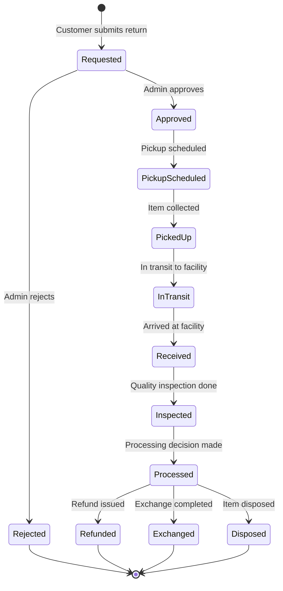

# Reverse Logistics Service Documentation

## Overview

The Reverse Logistics Service manages returns, exchanges, and reverse supply chain operations for the Quenty platform. It provides comprehensive return request processing, quality inspection, disposition management, and customer service capabilities.

## Service Details

- **Port**: 8007
- **Database**: PostgreSQL (reverse_logistics_db)
- **Base URL**: `http://localhost:8007`
- **Health Check**: `GET /health`

## Core Features

### 1. Return Request Management
- Return request creation and validation
- Multi-item return processing
- Return authorization number (RMA) generation
- Customer communication and notifications

### 2. Return Processing Workflow
- Status tracking through complete lifecycle
- Pickup scheduling and logistics coordination
- Quality inspection and condition assessment
- Processing decision and resolution

### 3. Inventory Disposition
- Item condition evaluation and grading
- Disposition decision making (resell, refurbish, recycle)
- Recovery value calculation
- Environmental impact tracking

### 4. Quality Inspection
- Detailed item inspection reports
- Photo documentation and defect tracking
- Refurbishment cost estimation
- Resale value assessment

### 5. Customer Experience
- Self-service return portal
- Real-time tracking and updates
- Automated status notifications
- Return policy enforcement

## Data Models

### Return Model
```python
class Return(Base):
    __tablename__ = "returns"
    
    id = Column(Integer, primary_key=True, index=True)
    return_id = Column(String(255), unique=True, index=True)
    
    # Order and Customer Information
    original_order_id = Column(String(255), nullable=False, index=True)
    customer_id = Column(String(255), nullable=False, index=True)
    
    # Return Details
    return_type = Column(String(50), nullable=False, default="return")
    return_reason = Column(String(50), nullable=False)
    status = Column(String(50), nullable=False, default="requested", index=True)
    description = Column(Text)
    preferred_resolution = Column(String(50))  # refund, exchange, store_credit
    return_authorization_number = Column(String(255), unique=True, index=True)
    
    # Financial Information
    original_order_value = Column(Numeric(10, 2))
    estimated_refund_amount = Column(Numeric(10, 2))
    actual_refund_amount = Column(Numeric(10, 2))
    return_shipping_cost = Column(Numeric(10, 2), default=0)
    processing_fee = Column(Numeric(10, 2), default=0)
    
    # Shipping and Logistics
    pickup_address = Column(Text)
    return_address = Column(Text)
    tracking_number = Column(String(255), unique=True)
    carrier = Column(String(100))
    
    # Timeline Information
    estimated_pickup_date = Column(Date)
    actual_pickup_date = Column(Date)
    estimated_processing_time = Column(String(50))
    expires_at = Column(DateTime, nullable=False)
    
    # Processing Information
    approval_notes = Column(Text)
    rejection_reason = Column(Text)
    processing_notes = Column(Text)
    
    # Additional Data
    photos = Column(JSON, default=list)
    customer_action_required = Column(String(255))
    requires_customer_action = Column(Boolean, default=False)
    
    # System Fields
    created_by = Column(String(255))
    processed_by = Column(String(255))
    created_at = Column(DateTime, default=func.now(), nullable=False)
    updated_at = Column(DateTime, default=func.now(), onupdate=func.now())
    
    # Relationships
    items = relationship("ReturnItem", back_populates="return_record")
    inspections = relationship("InspectionReport", back_populates="return_record")
    status_history = relationship("ReturnStatusHistory", back_populates="return_record")
```

### Return Item Model
```python
class ReturnItem(Base):
    __tablename__ = "return_items"
    
    id = Column(Integer, primary_key=True, index=True)
    return_item_id = Column(String(255), unique=True, index=True)
    
    # Relationships
    return_id = Column(Integer, ForeignKey("returns.id"), nullable=False)
    
    # Item Information
    item_id = Column(String(255), nullable=False, index=True)
    item_name = Column(String(255))
    sku = Column(String(100))
    quantity = Column(Integer, nullable=False)
    unit_price = Column(Numeric(10, 2))
    
    # Return Specific Information
    return_reason = Column(String(50))
    reason_details = Column(Text)
    condition_received = Column(String(50))
    photos = Column(JSON, default=list)
    
    # Processing Information
    inspection_result = Column(String(50))
    resale_value = Column(Numeric(10, 2))
    refund_eligible = Column(Boolean, default=True)
    refund_amount = Column(Numeric(10, 2))
    
    # Exchange Information
    exchange_item_id = Column(String(255))
    exchange_quantity = Column(Integer)
    
    # System Fields
    created_at = Column(DateTime, default=func.now())
    updated_at = Column(DateTime, default=func.now(), onupdate=func.now())
    
    # Relationships
    return_record = relationship("Return", back_populates="items")
```

### Inspection Report Model
```python
class InspectionReport(Base):
    __tablename__ = "inspection_reports"
    
    id = Column(Integer, primary_key=True, index=True)
    inspection_id = Column(String(255), unique=True, index=True)
    
    # Relationships
    return_id = Column(Integer, ForeignKey("returns.id"), nullable=False)
    item_id = Column(String(255), nullable=False, index=True)
    
    # Inspector Information
    inspector_id = Column(String(255), nullable=False)
    inspector_name = Column(String(255))
    inspection_date = Column(DateTime, nullable=False, default=func.now())
    
    # Inspection Results
    overall_condition = Column(String(50), nullable=False)
    functional_status = Column(String(50))  # working, partially_working, non_functional
    cosmetic_condition = Column(String(50))  # excellent, good, fair, poor
    completeness = Column(String(50))  # complete, missing_accessories, incomplete
    
    # Detailed Findings
    defects_found = Column(JSON, default=list)
    photos = Column(JSON, default=list)
    notes = Column(Text)
    
    # Valuation
    original_value = Column(Numeric(10, 2))
    current_market_value = Column(Numeric(10, 2))
    resale_value = Column(Numeric(10, 2))
    salvage_value = Column(Numeric(10, 2))
    
    # Recommendations
    recommended_action = Column(String(100))  # full_refund, partial_refund, exchange, reject, repair
    disposition_recommendation = Column(String(50))  # resell, refurbish, donate, recycle, destroy
    repair_cost_estimate = Column(Numeric(10, 2))
    refurbishment_cost = Column(Numeric(10, 2))
    
    # System Fields
    created_at = Column(DateTime, default=func.now())
    updated_at = Column(DateTime, default=func.now(), onupdate=func.now())
    
    # Relationships
    return_record = relationship("Return", back_populates="inspections")
```

## API Endpoints

### Return Request Management

#### Create Return Request
```http
POST /api/v1/returns
Authorization: Bearer <access_token>
Content-Type: application/json

{
    "original_order_id": "ORDER-ABC123456",
    "customer_id": "CUST-789012345",
    "return_type": "return",
    "return_reason": "defective",
    "description": "Screen is flickering and not responding properly",
    "preferred_resolution": "refund",
    "items": [
        {
            "item_id": "ITEM-PHONE001",
            "item_name": "Smartphone XYZ Pro",
            "sku": "PHN-XYZ-PRO-128",
            "quantity": 1,
            "unit_price": 899.99,
            "return_reason": "defective",
            "reason_details": "Screen flickering, touch not responsive"
        }
    ],
    "photos": [
        "https://cdn.quenty.com/returns/photos/ret123_item1_front.jpg",
        "https://cdn.quenty.com/returns/photos/ret123_item1_screen.jpg"
    ]
}
```

**Response:**
```json
{
    "return_id": "RET-2025072201",
    "original_order_id": "ORDER-ABC123456",
    "customer_id": "CUST-789012345",
    "return_type": "return",
    "status": "requested",
    "return_reason": "defective",
    "return_authorization_number": "RMA-RET-2025072201",
    "estimated_refund_amount": 899.99,
    "return_shipping_cost": 0.00,
    "estimated_pickup_date": "2025-07-24",
    "estimated_processing_time": "3-5 business days",
    "expires_at": "2025-08-21T23:59:59.000Z",
    "items": [
        {
            "return_item_id": "RI-ABCD1234",
            "item_id": "ITEM-PHONE001",
            "item_name": "Smartphone XYZ Pro",
            "quantity": 1,
            "unit_price": 899.99,
            "refund_eligible": true
        }
    ],
    "created_at": "2025-07-22T10:30:00.000Z"
}
```

#### Get Return Details
```http
GET /api/v1/returns/RET-2025072201
Authorization: Bearer <access_token>
```

#### List Returns
```http
GET /api/v1/returns?limit=20&offset=0&status=inspected&customer_id=CUST-789012345
Authorization: Bearer <access_token>
```

**Response:**
```json
{
    "returns": [
        {
            "return_id": "RET-2025072201",
            "original_order_id": "ORDER-ABC123456",
            "customer_id": "CUST-789012345",
            "status": "inspected",
            "return_reason": "defective",
            "estimated_refund_amount": 899.99,
            "created_at": "2025-07-22T10:30:00.000Z",
            "items_count": 1
        }
    ],
    "total": 45,
    "limit": 20,
    "offset": 0,
    "has_next": true,
    "has_previous": false
}
```

### Return Processing Workflow

#### Approve Return
```http
PUT /api/v1/returns/RET-2025072201/approve
Authorization: Bearer <access_token>
Content-Type: application/json

{
    "approval_notes": "Valid defective product claim. Approved for return.",
    "estimated_pickup_date": "2025-07-24",
    "pickup_address": "Customer's registered address"
}
```

**Response:**
```json
{
    "return_id": "RET-2025072201",
    "status": "approved",
    "approved_at": "2025-07-22T14:15:00.000Z",
    "approval_notes": "Valid defective product claim. Approved for return.",
    "next_steps": "Return shipping label will be emailed to customer",
    "pickup_scheduled_for": "2025-07-24"
}
```

#### Schedule Pickup
```http
POST /api/v1/returns/RET-2025072201/schedule-pickup
Authorization: Bearer <access_token>
Content-Type: application/json

{
    "pickup_date": "2025-07-24",
    "time_window": "morning",
    "pickup_address": "Av. Reforma 123, Col. Centro, Mexico City",
    "special_instructions": "Ring doorbell twice, apartment 4B"
}
```

**Response:**
```json
{
    "return_id": "RET-2025072201",
    "status": "pickup_scheduled",
    "pickup_date": "2025-07-24",
    "time_window": "morning",
    "pickup_id": "PU-RET-2025072201",
    "tracking_number": "QTYRET-2025072201",
    "carrier": "Quenty Logistics",
    "special_instructions": "Ring doorbell twice, apartment 4B",
    "scheduled_at": "2025-07-22T14:30:00.000Z"
}
```

#### Create Inspection Report
```http
POST /api/v1/returns/RET-2025072201/inspection
Authorization: Bearer <access_token>
Content-Type: application/json

{
    "item_id": "ITEM-PHONE001",
    "inspector_id": "INSP-001",
    "overall_condition": "poor",
    "functional_status": "non_functional",
    "cosmetic_condition": "fair",
    "completeness": "complete",
    "defects_found": [
        "Screen flickering",
        "Touch screen unresponsive",
        "Minor scratches on back cover"
    ],
    "photos": [
        "https://cdn.quenty.com/inspections/insp123_front.jpg",
        "https://cdn.quenty.com/inspections/insp123_screen_issue.jpg"
    ],
    "notes": "Device confirmed defective. Screen issues as described by customer.",
    "current_market_value": 750.00,
    "resale_value": 0.00,
    "salvage_value": 50.00,
    "recommended_action": "full_refund",
    "disposition_recommendation": "recycle",
    "repair_cost_estimate": 300.00
}
```

**Response:**
```json
{
    "inspection_id": "INSP-20250722001",
    "return_id": "RET-2025072201",
    "item_id": "ITEM-PHONE001",
    "inspector_id": "INSP-001",
    "inspection_date": "2025-07-22T16:45:00.000Z",
    "overall_condition": "poor",
    "recommended_action": "full_refund",
    "disposition_recommendation": "recycle",
    "created_at": "2025-07-22T16:45:00.000Z"
}
```

#### Process Return
```http
POST /api/v1/returns/RET-2025072201/process
Authorization: Bearer <access_token>
Content-Type: application/json

{
    "processing_action": "approve_full_refund",
    "refund_amount": 899.99,
    "processing_notes": "Item confirmed defective. Full refund approved as per inspection report.",
    "processing_fee": 0.00
}
```

**Response:**
```json
{
    "return_id": "RET-2025072201",
    "processing_action": "approve_full_refund",
    "status": "refunded",
    "refund_amount": 899.99,
    "processing_fee": 0.00,
    "processed_at": "2025-07-22T17:00:00.000Z",
    "processing_notes": "Item confirmed defective. Full refund approved as per inspection report.",
    "expected_refund_time": "3-5 business days"
}
```

### Tracking and Status Updates

#### Track Return Progress
```http
GET /api/v1/returns/RET-2025072201/tracking
Authorization: Bearer <access_token>
```

**Response:**
```json
{
    "return_id": "RET-2025072201",
    "tracking_number": "QTYRET-2025072201",
    "current_status": "refunded",
    "current_location": "Processing Complete",
    "carrier": "Quenty Logistics",
    "events": [
        {
            "timestamp": "2025-07-22T10:30:00.000Z",
            "status": "requested",
            "location": "Request Submitted",
            "description": "Return request created",
            "notes": "Customer reported defective screen"
        },
        {
            "timestamp": "2025-07-22T14:15:00.000Z",
            "status": "approved",
            "location": "Approval Center",
            "description": "Return request approved"
        },
        {
            "timestamp": "2025-07-22T14:30:00.000Z",
            "status": "pickup_scheduled",
            "location": "Customer Address",
            "description": "Pickup scheduled",
            "tracking_number": "QTYRET-2025072201"
        },
        {
            "timestamp": "2025-07-24T09:15:00.000Z",
            "status": "picked_up",
            "location": "Customer Address",
            "description": "Package picked up from customer"
        },
        {
            "timestamp": "2025-07-24T16:30:00.000Z",
            "status": "received",
            "location": "Return Processing Center",
            "description": "Package received at processing center"
        },
        {
            "timestamp": "2025-07-24T16:45:00.000Z",
            "status": "inspected",
            "location": "Quality Control",
            "description": "Item inspection completed"
        },
        {
            "timestamp": "2025-07-24T17:00:00.000Z",
            "status": "refunded",
            "location": "Processing Complete",
            "description": "Full refund processed"
        }
    ],
    "last_updated": "2025-07-24T17:00:00.000Z"
}
```

## Return Processing Workflow

### Status Lifecycle


### Processing Rules

#### Automatic Approval Criteria
- Defective items within warranty period
- Wrong items shipped by error
- Damaged items during shipping
- Items not as described

#### Manual Review Required
- Change of mind returns >$500
- Items returned after 30 days
- Damaged packaging or missing accessories
- High-value electronics

#### Refund Calculations
```python
def calculate_refund_amount(return_item, return_reason):
    base_amount = return_item.unit_price
    
    # Restocking fees by reason
    restocking_fees = {
        'change_of_mind': 0.10,  # 10%
        'size_issue': 0.05,      # 5%
        'other': 0.10            # 10%
    }
    
    # No restocking fee for company errors
    if return_reason in ['defective', 'wrong_item', 'damaged', 'not_as_described']:
        return base_amount
    
    restocking_fee = base_amount * restocking_fees.get(return_reason, 0.10)
    return base_amount - restocking_fee
```

## Quality Inspection Process

### Inspection Criteria

#### Functional Assessment
- **Working**: Item functions as expected
- **Partially Working**: Some features impaired
- **Non-Functional**: Item does not work

#### Cosmetic Condition
- **Excellent**: Like new, no visible wear
- **Good**: Minor signs of use, no defects
- **Fair**: Visible wear but functional
- **Poor**: Significant cosmetic damage

#### Completeness Check
- **Complete**: All original accessories included
- **Missing Accessories**: Some items missing
- **Incomplete**: Major components missing

### Disposition Decision Matrix

| Condition | Functional | Disposition | Recovery Value |
|-----------|------------|-------------|----------------|
| Excellent | Working | Resell as Like-New | 85-95% |
| Good | Working | Resell as Refurbished | 70-85% |
| Fair | Working | Resell as Used | 50-70% |
| Poor | Working | Repair/Refurbish | 30-50% |
| Any | Non-Functional | Recycle/Parts | 5-15% |
| Any | Damaged Beyond Repair | Dispose | 0% |

## Integration with Other Services

### Order Service Integration
```python
# Validate original order
async def validate_return_eligibility(order_id, customer_id):
    order_response = await order_service.get_order(order_id)
    
    if order_response.customer_id != customer_id:
        raise ValidationError("Order does not belong to customer")
    
    if order_response.status not in ['delivered', 'completed']:
        raise ValidationError("Order not eligible for return")
    
    return_window = 30  # days
    if (datetime.now() - order_response.delivery_date).days > return_window:
        raise ValidationError("Return window expired")
    
    return True
```

### Inventory Service Integration
```python
# Update inventory after return processing
async def update_inventory_after_return(return_item, disposition):
    if disposition == 'resell':
        await inventory_service.add_item(
            item_id=return_item.item_id,
            condition='refurbished',
            quantity=return_item.quantity
        )
    elif disposition == 'recycle':
        await inventory_service.mark_recycled(
            item_id=return_item.item_id,
            quantity=return_item.quantity
        )
```

### Payment Service Integration
```python
# Process refund payment
async def process_refund(return_record):
    refund_request = {
        'original_transaction_id': return_record.original_order.payment_id,
        'refund_amount': return_record.actual_refund_amount,
        'reason': return_record.return_reason,
        'reference': return_record.return_id
    }
    
    refund_result = await payment_service.process_refund(refund_request)
    
    if refund_result.success:
        return_record.status = 'refunded'
        return_record.refund_transaction_id = refund_result.transaction_id
    
    return refund_result
```

## Environmental Impact Tracking

### Sustainability Metrics
- **Items Resold**: Percentage of returns resold vs. disposed
- **Carbon Footprint**: CO2 impact of return transportation
- **Waste Reduction**: Materials diverted from landfills
- **Recycling Rate**: Percentage of items properly recycled

### Disposal Partners
- **Electronics Recycling**: Certified e-waste recyclers
- **Textile Recycling**: Clothing and fabric recycling partners
- **Material Recovery**: Parts and components recovery
- **Donation Programs**: Charitable organizations for usable items

## Performance Metrics and KPIs

### Operational Metrics
- **Return Rate**: Percentage of orders returned
- **Processing Time**: Average time from receipt to resolution
- **Customer Satisfaction**: Rating of return experience
- **Recovery Rate**: Value recovered vs. original price

### Financial Metrics
- **Return Costs**: Total cost of processing returns
- **Recovery Value**: Revenue from resold returned items
- **Refund Rate**: Percentage of returns resulting in refunds
- **Net Return Impact**: Overall financial impact of returns

### Quality Metrics
- **Inspection Accuracy**: Accuracy of initial quality assessments
- **Dispute Rate**: Percentage of return decisions disputed
- **Rework Rate**: Items requiring additional processing
- **Partner Performance**: Third-party service provider metrics

## Security and Compliance

### Data Protection
- Customer return information encryption
- Photo and document secure storage
- Access logging for sensitive operations
- GDPR compliance for personal data

### Fraud Prevention
- Return pattern analysis
- Suspicious activity detection
- Photo verification requirements
- Cross-reference with order history

### Compliance Requirements
- Consumer protection law compliance
- Return policy enforcement
- Warranty claim processing
- Environmental disposal regulations

## Monitoring and Alerts

### System Health Monitoring
- Return processing pipeline health
- Database performance and connectivity
- Integration service availability
- File storage and photo processing

### Business Alerts
- High return rate alerts
- Processing time SLA breaches
- Customer satisfaction score drops
- Inventory impact notifications

## Troubleshooting

### Common Issues

#### 1. Return Request Validation Failures
**Problem**: Return requests being rejected during validation
**Solution**:
- Verify order ID and customer ID match
- Check return window eligibility
- Validate item eligibility for returns

#### 2. Pickup Scheduling Issues
**Problem**: Pickup scheduling failures or delays
**Solution**:
- Verify customer address information
- Check carrier service availability
- Confirm pickup time slot availability

#### 3. Inspection Report Discrepancies
**Problem**: Customer disputes inspection findings
**Solution**:
- Review inspection photos and notes
- Conduct secondary inspection if needed
- Escalate to senior quality inspector

### Debug Commands
```bash
# Check service health
curl http://localhost:8007/health

# Get return details
curl -H "Authorization: Bearer <token>" \
  "http://localhost:8007/api/v1/returns/RET-123456"

# Check return tracking
curl -H "Authorization: Bearer <token>" \
  "http://localhost:8007/api/v1/returns/RET-123456/tracking"
```